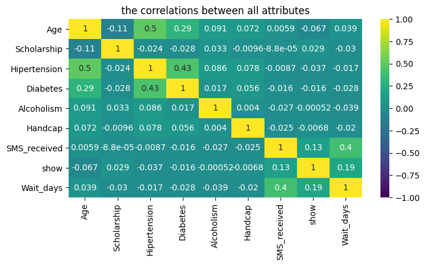
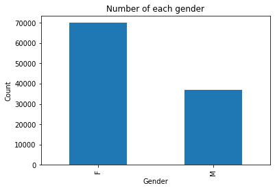
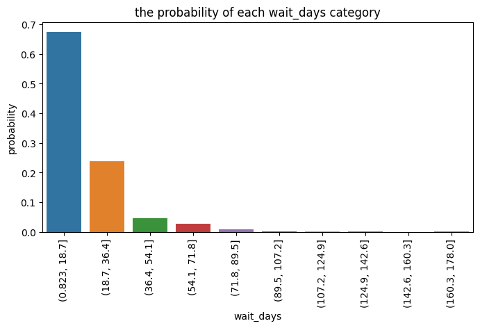

# Patient-no-show-Analysis
an analysis to explain what make a patient miss the appointment.

# Project: Investigate a Dataset (Medical Appointment No Shows)

## Table of Contents
<ul>
<li><a href="#intro">Introduction</a></li>
<li><a href="#wrangling">Data Wrangling</a></li>
<li><a href="#eda">Exploratory Data Analysis</a> using a kaggle notebook</li>
<li><a href="#conclusions">Conclusions</a></li>
</ul>

<a id='intro'></a>
## Introduction

in this notebook,we need to know what make the patient not showing up for his medical appointment.

the dataset with about 110527 record and 14 feature.


# Quesions
- What factors are important for us to know in order to predict if a patient will show up for their scheduled appointment?
- is Gender has impact on No-show ?
- is wait_day has impact on No_show ?
- is the patient who receive a SMS has more probability to show ?

#### importing the library we will use


```python
import pandas as pd
import numpy as np
import matplotlib.pyplot as plt
import seaborn as sns
%matplotlib inline

```

<a id='wrangling'></a>
## Data Wrangling

in this section
- import our dataset 
- assess the dataset, then
- clean the dataset

### General Properties
importing the data set


```python
df = pd.read_csv('KaggleV2-May-2016.csv')
df.head()
```


<div>
<style scoped>
    .dataframe tbody tr th:only-of-type {
        vertical-align: middle;
    }

    .dataframe tbody tr th {
        vertical-align: top;
    }

    .dataframe thead th {
        text-align: right;
    }
</style>
<table border="1" class="dataframe">
  <thead>
    <tr style="text-align: right;">
      <th></th>
      <th>PatientId</th>
      <th>AppointmentID</th>
      <th>Gender</th>
      <th>ScheduledDay</th>
      <th>AppointmentDay</th>
      <th>Age</th>
      <th>Neighbourhood</th>
      <th>Scholarship</th>
      <th>Hipertension</th>
      <th>Diabetes</th>
      <th>Alcoholism</th>
      <th>Handcap</th>
      <th>SMS_received</th>
      <th>No-show</th>
    </tr>
  </thead>
  <tbody>
    <tr>
      <th>0</th>
      <td>29872499824296</td>
      <td>5642903</td>
      <td>F</td>
      <td>2016-04-29T18:38:08Z</td>
      <td>2016-04-29T00:00:00Z</td>
      <td>62</td>
      <td>JARDIM DA PENHA</td>
      <td>0</td>
      <td>1</td>
      <td>0</td>
      <td>0</td>
      <td>0</td>
      <td>0</td>
      <td>No</td>
    </tr>
    <tr>
      <th>1</th>
      <td>558997776694438</td>
      <td>5642503</td>
      <td>M</td>
      <td>2016-04-29T16:08:27Z</td>
      <td>2016-04-29T00:00:00Z</td>
      <td>56</td>
      <td>JARDIM DA PENHA</td>
      <td>0</td>
      <td>0</td>
      <td>0</td>
      <td>0</td>
      <td>0</td>
      <td>0</td>
      <td>No</td>
    </tr>
    <tr>
      <th>2</th>
      <td>4262962299951</td>
      <td>5642549</td>
      <td>F</td>
      <td>2016-04-29T16:19:04Z</td>
      <td>2016-04-29T00:00:00Z</td>
      <td>62</td>
      <td>MATA DA PRAIA</td>
      <td>0</td>
      <td>0</td>
      <td>0</td>
      <td>0</td>
      <td>0</td>
      <td>0</td>
      <td>No</td>
    </tr>
    <tr>
      <th>3</th>
      <td>867951213174</td>
      <td>5642828</td>
      <td>F</td>
      <td>2016-04-29T17:29:31Z</td>
      <td>2016-04-29T00:00:00Z</td>
      <td>8</td>
      <td>PONTAL DE CAMBURI</td>
      <td>0</td>
      <td>0</td>
      <td>0</td>
      <td>0</td>
      <td>0</td>
      <td>0</td>
      <td>No</td>
    </tr>
    <tr>
      <th>4</th>
      <td>8841186448183</td>
      <td>5642494</td>
      <td>F</td>
      <td>2016-04-29T16:07:23Z</td>
      <td>2016-04-29T00:00:00Z</td>
      <td>56</td>
      <td>JARDIM DA PENHA</td>
      <td>0</td>
      <td>1</td>
      <td>1</td>
      <td>0</td>
      <td>0</td>
      <td>0</td>
      <td>No</td>
    </tr>
  </tbody>
</table>
</div>


```python
df.shape
```


    (110527, 14)


```python
df.describe()
```


<div>
<style scoped>
    .dataframe tbody tr th:only-of-type {
        vertical-align: middle;
    }

    .dataframe tbody tr th {
        vertical-align: top;
    }

    .dataframe thead th {
        text-align: right;
    }
</style>
<table border="1" class="dataframe">
  <thead>
    <tr style="text-align: right;">
      <th></th>
      <th>PatientId</th>
      <th>AppointmentID</th>
      <th>Age</th>
      <th>Scholarship</th>
      <th>Hipertension</th>
      <th>Diabetes</th>
      <th>Alcoholism</th>
      <th>Handcap</th>
      <th>SMS_received</th>
    </tr>
  </thead>
  <tbody>
    <tr>
      <th>count</th>
      <td>1.105270e+05</td>
      <td>1.105270e+05</td>
      <td>110527.000000</td>
      <td>110527.000000</td>
      <td>110527.000000</td>
      <td>110527.000000</td>
      <td>110527.000000</td>
      <td>110527.000000</td>
      <td>110527.000000</td>
    </tr>
    <tr>
      <th>mean</th>
      <td>1.474963e+14</td>
      <td>5.675305e+06</td>
      <td>37.088874</td>
      <td>0.098266</td>
      <td>0.197246</td>
      <td>0.071865</td>
      <td>0.030400</td>
      <td>0.022248</td>
      <td>0.321026</td>
    </tr>
    <tr>
      <th>std</th>
      <td>2.560949e+14</td>
      <td>7.129575e+04</td>
      <td>23.110205</td>
      <td>0.297675</td>
      <td>0.397921</td>
      <td>0.258265</td>
      <td>0.171686</td>
      <td>0.161543</td>
      <td>0.466873</td>
    </tr>
    <tr>
      <th>min</th>
      <td>3.921800e+04</td>
      <td>5.030230e+06</td>
      <td>-1.000000</td>
      <td>0.000000</td>
      <td>0.000000</td>
      <td>0.000000</td>
      <td>0.000000</td>
      <td>0.000000</td>
      <td>0.000000</td>
    </tr>
    <tr>
      <th>25%</th>
      <td>4.172614e+12</td>
      <td>5.640286e+06</td>
      <td>18.000000</td>
      <td>0.000000</td>
      <td>0.000000</td>
      <td>0.000000</td>
      <td>0.000000</td>
      <td>0.000000</td>
      <td>0.000000</td>
    </tr>
    <tr>
      <th>50%</th>
      <td>3.173184e+13</td>
      <td>5.680573e+06</td>
      <td>37.000000</td>
      <td>0.000000</td>
      <td>0.000000</td>
      <td>0.000000</td>
      <td>0.000000</td>
      <td>0.000000</td>
      <td>0.000000</td>
    </tr>
    <tr>
      <th>75%</th>
      <td>9.439172e+13</td>
      <td>5.725524e+06</td>
      <td>55.000000</td>
      <td>0.000000</td>
      <td>0.000000</td>
      <td>0.000000</td>
      <td>0.000000</td>
      <td>0.000000</td>
      <td>1.000000</td>
    </tr>
    <tr>
      <th>max</th>
      <td>9.999816e+14</td>
      <td>5.790484e+06</td>
      <td>115.000000</td>
      <td>1.000000</td>
      <td>1.000000</td>
      <td>1.000000</td>
      <td>1.000000</td>
      <td>4.000000</td>
      <td>1.000000</td>
    </tr>
  </tbody>
</table>
</div>


```python
df.info()
```

    <class 'pandas.core.frame.DataFrame'>
    RangeIndex: 110527 entries, 0 to 110526
    Data columns (total 14 columns):
     #   Column          Non-Null Count   Dtype 
    ---  ------          --------------   ----- 
     0   PatientId       110527 non-null  int64 
     1   AppointmentID   110527 non-null  int64 
     2   Gender          110527 non-null  object
     3   ScheduledDay    110527 non-null  object
     4   AppointmentDay  110527 non-null  object
     5   Age             110527 non-null  int64 
     6   Neighbourhood   110527 non-null  object
     7   Scholarship     110527 non-null  int64 
     8   Hipertension    110527 non-null  int64 
     9   Diabetes        110527 non-null  int64 
     10  Alcoholism      110527 non-null  int64 
     11  Handcap         110527 non-null  int64 
     12  SMS_received    110527 non-null  int64 
     13  No-show         110527 non-null  object
    dtypes: int64(9), object(5)
    memory usage: 11.8+ MB
    


```python
df.nunique()
```


    PatientId          62299
    AppointmentID     110527
    Gender                 2
    ScheduledDay      103549
    AppointmentDay        27
    Age                  104
    Neighbourhood         81
    Scholarship            2
    Hipertension           2
    Diabetes               2
    Alcoholism             2
    Handcap                5
    SMS_received           2
    No-show                2
    dtype: int64


## results of assessing
##### we need to perform some cleaning step,
<ul>
    <li>no-show : transform to int</li>
    <li>drop unrelated features (PatientId,AppointmentID,ScheduledDay)</li>
    <li>transform the data to appropriate format</li>
    <li>remove Age outliers</li>
</ul>

# Data Cleaning
change `No-show` to `show` <br>
convert the type to int


```python
df.loc[df['No-show'] == 'No','No-show'] = int(0)
df.loc[df['No-show'] == 'Yes','No-show'] = int(1)
df.rename(columns={'No-show':'show'},inplace=True)
df['show'] = df['show'].astype(int)
```

convert the type of `AppointmentDay,ScheduledDay` to datetime


```python
df['AppointmentDay'] = df['AppointmentDay'].apply(np.datetime64)
df['ScheduledDay'] = df['ScheduledDay'].apply(np.datetime64)
```

convert the type of `Gender` to int


```python
# df.loc[df['Gender'] == 'M','Gender'] = int(0)
# df.loc[df['Gender'] == 'F','Gender'] = int(1)
# df['Gender'] = df['Gender'].astype(int)
```

remove the outliers from the age


```python

df = df[ df['Age'] > 0 ]
df = df[ df['Age'] < 95]
```

remove the `PatientId,AppointmentID` attribute from the data because it have no effect


```python
#df.drop(['PatientId','AppointmentID' ] ,axis=1 , inplace=True)
```

generate `wait_days` from `AppointmentDay` and `ScheduledDay`


```python
df["Wait_days"] = df["AppointmentDay"] - df["ScheduledDay"]
df["Wait_days"] = df["Wait_days"].astype(str)
df["Wait_days"] = df["Wait_days"].apply(lambda x: x.split(" ")[0])
df["Wait_days"] = df["Wait_days"].astype(int)
```


```python
#remove unrealistic wait_day ( < 0 days)
#df = df[df['Wait_days'] > 0]

#cut wait days ito intrval
#df['Wait_days'] = pd.cut(df['Wait_days'] , 10)
```

### Test the cleaning


```python
df.info()
```

    <class 'pandas.core.frame.DataFrame'>
    Int64Index: 106917 entries, 0 to 110526
    Data columns (total 15 columns):
     #   Column          Non-Null Count   Dtype         
    ---  ------          --------------   -----         
     0   PatientId       106917 non-null  int64         
     1   AppointmentID   106917 non-null  int64         
     2   Gender          106917 non-null  object        
     3   ScheduledDay    106917 non-null  datetime64[ns]
     4   AppointmentDay  106917 non-null  datetime64[ns]
     5   Age             106917 non-null  int64         
     6   Neighbourhood   106917 non-null  object        
     7   Scholarship     106917 non-null  int64         
     8   Hipertension    106917 non-null  int64         
     9   Diabetes        106917 non-null  int64         
     10  Alcoholism      106917 non-null  int64         
     11  Handcap         106917 non-null  int64         
     12  SMS_received    106917 non-null  int64         
     13  show            106917 non-null  int32         
     14  Wait_days       106917 non-null  int32         
    dtypes: datetime64[ns](2), int32(2), int64(9), object(2)
    memory usage: 12.2+ MB
    


```python
df.head()
```


<div>
<style scoped>
    .dataframe tbody tr th:only-of-type {
        vertical-align: middle;
    }

    .dataframe tbody tr th {
        vertical-align: top;
    }

    .dataframe thead th {
        text-align: right;
    }
</style>
<table border="1" class="dataframe">
  <thead>
    <tr style="text-align: right;">
      <th></th>
      <th>PatientId</th>
      <th>AppointmentID</th>
      <th>Gender</th>
      <th>ScheduledDay</th>
      <th>AppointmentDay</th>
      <th>Age</th>
      <th>Neighbourhood</th>
      <th>Scholarship</th>
      <th>Hipertension</th>
      <th>Diabetes</th>
      <th>Alcoholism</th>
      <th>Handcap</th>
      <th>SMS_received</th>
      <th>show</th>
      <th>Wait_days</th>
    </tr>
  </thead>
  <tbody>
    <tr>
      <th>0</th>
      <td>29872499824296</td>
      <td>5642903</td>
      <td>F</td>
      <td>2016-04-29 18:38:08</td>
      <td>2016-04-29</td>
      <td>62</td>
      <td>JARDIM DA PENHA</td>
      <td>0</td>
      <td>1</td>
      <td>0</td>
      <td>0</td>
      <td>0</td>
      <td>0</td>
      <td>0</td>
      <td>-1</td>
    </tr>
    <tr>
      <th>1</th>
      <td>558997776694438</td>
      <td>5642503</td>
      <td>M</td>
      <td>2016-04-29 16:08:27</td>
      <td>2016-04-29</td>
      <td>56</td>
      <td>JARDIM DA PENHA</td>
      <td>0</td>
      <td>0</td>
      <td>0</td>
      <td>0</td>
      <td>0</td>
      <td>0</td>
      <td>0</td>
      <td>-1</td>
    </tr>
    <tr>
      <th>2</th>
      <td>4262962299951</td>
      <td>5642549</td>
      <td>F</td>
      <td>2016-04-29 16:19:04</td>
      <td>2016-04-29</td>
      <td>62</td>
      <td>MATA DA PRAIA</td>
      <td>0</td>
      <td>0</td>
      <td>0</td>
      <td>0</td>
      <td>0</td>
      <td>0</td>
      <td>0</td>
      <td>-1</td>
    </tr>
    <tr>
      <th>3</th>
      <td>867951213174</td>
      <td>5642828</td>
      <td>F</td>
      <td>2016-04-29 17:29:31</td>
      <td>2016-04-29</td>
      <td>8</td>
      <td>PONTAL DE CAMBURI</td>
      <td>0</td>
      <td>0</td>
      <td>0</td>
      <td>0</td>
      <td>0</td>
      <td>0</td>
      <td>0</td>
      <td>-1</td>
    </tr>
    <tr>
      <th>4</th>
      <td>8841186448183</td>
      <td>5642494</td>
      <td>F</td>
      <td>2016-04-29 16:07:23</td>
      <td>2016-04-29</td>
      <td>56</td>
      <td>JARDIM DA PENHA</td>
      <td>0</td>
      <td>1</td>
      <td>1</td>
      <td>0</td>
      <td>0</td>
      <td>0</td>
      <td>0</td>
      <td>-1</td>
    </tr>
  </tbody>
</table>
</div>


## End of data wrangling section

<a id='eda'></a>
## Exploratory Data Analysis


### Research Question 1 
-  What factors are important for us to know in order to predict if a patient will show up for their scheduled appointment?


```python
df.describe()
```


<div>
<style scoped>
    .dataframe tbody tr th:only-of-type {
        vertical-align: middle;
    }

    .dataframe tbody tr th {
        vertical-align: top;
    }

    .dataframe thead th {
        text-align: right;
    }
</style>
<table border="1" class="dataframe">
  <thead>
    <tr style="text-align: right;">
      <th></th>
      <th>PatientId</th>
      <th>AppointmentID</th>
      <th>Age</th>
      <th>Scholarship</th>
      <th>Hipertension</th>
      <th>Diabetes</th>
      <th>Alcoholism</th>
      <th>Handcap</th>
      <th>SMS_received</th>
      <th>show</th>
      <th>Wait_days</th>
    </tr>
  </thead>
  <tbody>
    <tr>
      <th>count</th>
      <td>1.069170e+05</td>
      <td>1.069170e+05</td>
      <td>106917.000000</td>
      <td>106917.000000</td>
      <td>106917.00000</td>
      <td>106917.000000</td>
      <td>106917.000000</td>
      <td>106917.000000</td>
      <td>106917.000000</td>
      <td>106917.000000</td>
      <td>106917.000000</td>
    </tr>
    <tr>
      <th>mean</th>
      <td>1.472528e+14</td>
      <td>5.675433e+06</td>
      <td>38.277150</td>
      <td>0.101097</td>
      <td>0.20355</td>
      <td>0.074198</td>
      <td>0.031426</td>
      <td>0.022831</td>
      <td>0.323372</td>
      <td>0.202653</td>
      <td>9.166737</td>
    </tr>
    <tr>
      <th>std</th>
      <td>2.557886e+14</td>
      <td>7.131281e+04</td>
      <td>22.421586</td>
      <td>0.301459</td>
      <td>0.40264</td>
      <td>0.262094</td>
      <td>0.174468</td>
      <td>0.163648</td>
      <td>0.467766</td>
      <td>0.401978</td>
      <td>15.259851</td>
    </tr>
    <tr>
      <th>min</th>
      <td>3.921800e+04</td>
      <td>5.030230e+06</td>
      <td>1.000000</td>
      <td>0.000000</td>
      <td>0.00000</td>
      <td>0.000000</td>
      <td>0.000000</td>
      <td>0.000000</td>
      <td>0.000000</td>
      <td>0.000000</td>
      <td>-7.000000</td>
    </tr>
    <tr>
      <th>25%</th>
      <td>4.173166e+12</td>
      <td>5.640488e+06</td>
      <td>19.000000</td>
      <td>0.000000</td>
      <td>0.00000</td>
      <td>0.000000</td>
      <td>0.000000</td>
      <td>0.000000</td>
      <td>0.000000</td>
      <td>0.000000</td>
      <td>-1.000000</td>
    </tr>
    <tr>
      <th>50%</th>
      <td>3.169497e+13</td>
      <td>5.680736e+06</td>
      <td>38.000000</td>
      <td>0.000000</td>
      <td>0.00000</td>
      <td>0.000000</td>
      <td>0.000000</td>
      <td>0.000000</td>
      <td>0.000000</td>
      <td>0.000000</td>
      <td>3.000000</td>
    </tr>
    <tr>
      <th>75%</th>
      <td>9.432679e+13</td>
      <td>5.725621e+06</td>
      <td>56.000000</td>
      <td>0.000000</td>
      <td>0.00000</td>
      <td>0.000000</td>
      <td>0.000000</td>
      <td>0.000000</td>
      <td>1.000000</td>
      <td>0.000000</td>
      <td>13.000000</td>
    </tr>
    <tr>
      <th>max</th>
      <td>9.999816e+14</td>
      <td>5.790484e+06</td>
      <td>94.000000</td>
      <td>1.000000</td>
      <td>1.00000</td>
      <td>1.000000</td>
      <td>1.000000</td>
      <td>4.000000</td>
      <td>1.000000</td>
      <td>1.000000</td>
      <td>178.000000</td>
    </tr>
  </tbody>
</table>
</div>


```python
df.corr()
```


<div>
<style scoped>
    .dataframe tbody tr th:only-of-type {
        vertical-align: middle;
    }

    .dataframe tbody tr th {
        vertical-align: top;
    }

    .dataframe thead th {
        text-align: right;
    }
</style>
<table border="1" class="dataframe">
  <thead>
    <tr style="text-align: right;">
      <th></th>
      <th>PatientId</th>
      <th>AppointmentID</th>
      <th>Age</th>
      <th>Scholarship</th>
      <th>Hipertension</th>
      <th>Diabetes</th>
      <th>Alcoholism</th>
      <th>Handcap</th>
      <th>SMS_received</th>
      <th>show</th>
      <th>Wait_days</th>
    </tr>
  </thead>
  <tbody>
    <tr>
      <th>PatientId</th>
      <td>1.000000</td>
      <td>0.004158</td>
      <td>-0.003277</td>
      <td>-0.002136</td>
      <td>-0.006278</td>
      <td>0.001883</td>
      <td>0.011387</td>
      <td>-0.007566</td>
      <td>-0.008362</td>
      <td>-0.001040</td>
      <td>-0.000814</td>
    </tr>
    <tr>
      <th>AppointmentID</th>
      <td>0.004158</td>
      <td>1.000000</td>
      <td>-0.023535</td>
      <td>0.022402</td>
      <td>0.012312</td>
      <td>0.022723</td>
      <td>0.033183</td>
      <td>0.013885</td>
      <td>-0.254629</td>
      <td>-0.161527</td>
      <td>-0.771885</td>
    </tr>
    <tr>
      <th>Age</th>
      <td>-0.003277</td>
      <td>-0.023535</td>
      <td>1.000000</td>
      <td>-0.112382</td>
      <td>0.502198</td>
      <td>0.291049</td>
      <td>0.090914</td>
      <td>0.072023</td>
      <td>0.005881</td>
      <td>-0.067161</td>
      <td>0.038987</td>
    </tr>
    <tr>
      <th>Scholarship</th>
      <td>-0.002136</td>
      <td>0.022402</td>
      <td>-0.112382</td>
      <td>1.000000</td>
      <td>-0.024364</td>
      <td>-0.027583</td>
      <td>0.033489</td>
      <td>-0.009627</td>
      <td>-0.000088</td>
      <td>0.029371</td>
      <td>-0.030458</td>
    </tr>
    <tr>
      <th>Hipertension</th>
      <td>-0.006278</td>
      <td>0.012312</td>
      <td>0.502198</td>
      <td>-0.024364</td>
      <td>1.000000</td>
      <td>0.431031</td>
      <td>0.085622</td>
      <td>0.078091</td>
      <td>-0.008718</td>
      <td>-0.037408</td>
      <td>-0.017222</td>
    </tr>
    <tr>
      <th>Diabetes</th>
      <td>0.001883</td>
      <td>0.022723</td>
      <td>0.291049</td>
      <td>-0.027583</td>
      <td>0.431031</td>
      <td>1.000000</td>
      <td>0.016915</td>
      <td>0.056236</td>
      <td>-0.016274</td>
      <td>-0.016037</td>
      <td>-0.027644</td>
    </tr>
    <tr>
      <th>Alcoholism</th>
      <td>0.011387</td>
      <td>0.033183</td>
      <td>0.090914</td>
      <td>0.033489</td>
      <td>0.085622</td>
      <td>0.016915</td>
      <td>1.000000</td>
      <td>0.004026</td>
      <td>-0.027452</td>
      <td>-0.000522</td>
      <td>-0.038972</td>
    </tr>
    <tr>
      <th>Handcap</th>
      <td>-0.007566</td>
      <td>0.013885</td>
      <td>0.072023</td>
      <td>-0.009627</td>
      <td>0.078091</td>
      <td>0.056236</td>
      <td>0.004026</td>
      <td>1.000000</td>
      <td>-0.025091</td>
      <td>-0.006779</td>
      <td>-0.020184</td>
    </tr>
    <tr>
      <th>SMS_received</th>
      <td>-0.008362</td>
      <td>-0.254629</td>
      <td>0.005881</td>
      <td>-0.000088</td>
      <td>-0.008718</td>
      <td>-0.016274</td>
      <td>-0.027452</td>
      <td>-0.025091</td>
      <td>1.000000</td>
      <td>0.127266</td>
      <td>0.396486</td>
    </tr>
    <tr>
      <th>show</th>
      <td>-0.001040</td>
      <td>-0.161527</td>
      <td>-0.067161</td>
      <td>0.029371</td>
      <td>-0.037408</td>
      <td>-0.016037</td>
      <td>-0.000522</td>
      <td>-0.006779</td>
      <td>0.127266</td>
      <td>1.000000</td>
      <td>0.185663</td>
    </tr>
    <tr>
      <th>Wait_days</th>
      <td>-0.000814</td>
      <td>-0.771885</td>
      <td>0.038987</td>
      <td>-0.030458</td>
      <td>-0.017222</td>
      <td>-0.027644</td>
      <td>-0.038972</td>
      <td>-0.020184</td>
      <td>0.396486</td>
      <td>0.185663</td>
      <td>1.000000</td>
    </tr>
  </tbody>
</table>
</div>


```python
plt.figure(figsize=(8,4),dpi=100)
plt.title("the correlations between all attributes")
sns.heatmap(df.drop(['PatientId','AppointmentID'],axis=1).corr(),vmax=1,vmin=-1,cmap='viridis',annot=True);
```


    

    


this visaulize the degree of the relation between all attribute, showing that:
- there are only a relation between `show` and both of `SMS_recieved` and `wait_days`
- there are relation between `age` and both of `hipertension` and `diabetes`
- there is  relation between `hipertension` and `diabetes` 


```python
def single_variable_pivot_table(x,y='show'):
    return pd.pivot_table(data = df, index = x, values = y)
```


```python
def grouped_pivot_table(x,y,z='show'):
    list_ = [x,y]
    return pd.pivot_table(data = df, index = list_, values = z)
```

### Research Question 2
is Gender has impact on show ?


```python
df.groupby('Gender')['PatientId'].count().plot(kind="bar").set_ylabel("Count")
plt.title('Number of each gender')
df.groupby('Gender')[['PatientId']].count()
```


<div>
<style scoped>
    .dataframe tbody tr th:only-of-type {
        vertical-align: middle;
    }

    .dataframe tbody tr th {
        vertical-align: top;
    }

    .dataframe thead th {
        text-align: right;
    }
</style>
<table border="1" class="dataframe">
  <thead>
    <tr style="text-align: right;">
      <th></th>
      <th>PatientId</th>
    </tr>
    <tr>
      <th>Gender</th>
      <th></th>
    </tr>
  </thead>
  <tbody>
    <tr>
      <th>F</th>
      <td>70063</td>
    </tr>
    <tr>
      <th>M</th>
      <td>36854</td>
    </tr>
  </tbody>
</table>
</div>


    

    


here, check the relation between `Gender` and `show`


```python
#gender x show
gender_impact = single_variable_pivot_table('Gender')
round(gender_impact * 100, 2) 
```


<div>
<style scoped>
    .dataframe tbody tr th:only-of-type {
        vertical-align: middle;
    }

    .dataframe tbody tr th {
        vertical-align: top;
    }

    .dataframe thead th {
        text-align: right;
    }
</style>
<table border="1" class="dataframe">
  <thead>
    <tr style="text-align: right;">
      <th></th>
      <th>show</th>
    </tr>
    <tr>
      <th>Gender</th>
      <th></th>
    </tr>
  </thead>
  <tbody>
    <tr>
      <th>F</th>
      <td>20.36</td>
    </tr>
    <tr>
      <th>M</th>
      <td>20.08</td>
    </tr>
  </tbody>
</table>
</div>


gender with other attributes impacts x show


```python
gender_Hipertension_impact = grouped_pivot_table("Gender","Hipertension")
round(gender_Hipertension_impact * 100, 2) 

```


<div>
<style scoped>
    .dataframe tbody tr th:only-of-type {
        vertical-align: middle;
    }

    .dataframe tbody tr th {
        vertical-align: top;
    }

    .dataframe thead th {
        text-align: right;
    }
</style>
<table border="1" class="dataframe">
  <thead>
    <tr style="text-align: right;">
      <th></th>
      <th></th>
      <th>show</th>
    </tr>
    <tr>
      <th>Gender</th>
      <th>Hipertension</th>
      <th></th>
    </tr>
  </thead>
  <tbody>
    <tr>
      <th rowspan="2" valign="top">F</th>
      <th>0</th>
      <td>21.21</td>
    </tr>
    <tr>
      <th>1</th>
      <td>17.31</td>
    </tr>
    <tr>
      <th rowspan="2" valign="top">M</th>
      <th>0</th>
      <td>20.69</td>
    </tr>
    <tr>
      <th>1</th>
      <td>17.24</td>
    </tr>
  </tbody>
</table>
</div>


```python
gender_Diabetes_impact = grouped_pivot_table('Gender','Diabetes')
round(gender_Diabetes_impact * 100, 2) 
```


<div>
<style scoped>
    .dataframe tbody tr th:only-of-type {
        vertical-align: middle;
    }

    .dataframe tbody tr th {
        vertical-align: top;
    }

    .dataframe thead th {
        text-align: right;
    }
</style>
<table border="1" class="dataframe">
  <thead>
    <tr style="text-align: right;">
      <th></th>
      <th></th>
      <th>show</th>
    </tr>
    <tr>
      <th>Gender</th>
      <th>Diabetes</th>
      <th></th>
    </tr>
  </thead>
  <tbody>
    <tr>
      <th rowspan="2" valign="top">F</th>
      <th>0</th>
      <td>20.55</td>
    </tr>
    <tr>
      <th>1</th>
      <td>18.12</td>
    </tr>
    <tr>
      <th rowspan="2" valign="top">M</th>
      <th>0</th>
      <td>20.25</td>
    </tr>
    <tr>
      <th>1</th>
      <td>17.67</td>
    </tr>
  </tbody>
</table>
</div>


```python
gender_SMS_impact = grouped_pivot_table('Gender','SMS_received')
round(gender_SMS_impact * 100, 2) 
```


<div>
<style scoped>
    .dataframe tbody tr th:only-of-type {
        vertical-align: middle;
    }

    .dataframe tbody tr th {
        vertical-align: top;
    }

    .dataframe thead th {
        text-align: right;
    }
</style>
<table border="1" class="dataframe">
  <thead>
    <tr style="text-align: right;">
      <th></th>
      <th></th>
      <th>show</th>
    </tr>
    <tr>
      <th>Gender</th>
      <th>SMS_received</th>
      <th></th>
    </tr>
  </thead>
  <tbody>
    <tr>
      <th rowspan="2" valign="top">F</th>
      <th>0</th>
      <td>16.53</td>
    </tr>
    <tr>
      <th>1</th>
      <td>27.82</td>
    </tr>
    <tr>
      <th rowspan="2" valign="top">M</th>
      <th>0</th>
      <td>17.07</td>
    </tr>
    <tr>
      <th>1</th>
      <td>27.32</td>
    </tr>
  </tbody>
</table>
</div>


```python
gender_Scholarship_impact = grouped_pivot_table('Gender','Scholarship')
round(gender_Scholarship_impact * 100, 2) 
```


<div>
<style scoped>
    .dataframe tbody tr th:only-of-type {
        vertical-align: middle;
    }

    .dataframe tbody tr th {
        vertical-align: top;
    }

    .dataframe thead th {
        text-align: right;
    }
</style>
<table border="1" class="dataframe">
  <thead>
    <tr style="text-align: right;">
      <th></th>
      <th></th>
      <th>show</th>
    </tr>
    <tr>
      <th>Gender</th>
      <th>Scholarship</th>
      <th></th>
    </tr>
  </thead>
  <tbody>
    <tr>
      <th rowspan="2" valign="top">F</th>
      <th>0</th>
      <td>19.86</td>
    </tr>
    <tr>
      <th>1</th>
      <td>23.83</td>
    </tr>
    <tr>
      <th rowspan="2" valign="top">M</th>
      <th>0</th>
      <td>19.88</td>
    </tr>
    <tr>
      <th>1</th>
      <td>23.60</td>
    </tr>
  </tbody>
</table>
</div>


as we see, the `gender` have no impact over the `show`, because all results are close

### Research Question 3
is the patient who receive a SMS has more probability to show ?

SMS_recieved impact x show


```python
SMS_impact = single_variable_pivot_table("SMS_received")
round(SMS_impact * 100, 2) 

```


<div>
<style scoped>
    .dataframe tbody tr th:only-of-type {
        vertical-align: middle;
    }

    .dataframe tbody tr th {
        vertical-align: top;
    }

    .dataframe thead th {
        text-align: right;
    }
</style>
<table border="1" class="dataframe">
  <thead>
    <tr style="text-align: right;">
      <th></th>
      <th>show</th>
    </tr>
    <tr>
      <th>SMS_received</th>
      <th></th>
    </tr>
  </thead>
  <tbody>
    <tr>
      <th>0</th>
      <td>16.73</td>
    </tr>
    <tr>
      <th>1</th>
      <td>27.67</td>
    </tr>
  </tbody>
</table>
</div>


SMS with other attributes impacts x show


```python
SMS_Hipertension_impact = grouped_pivot_table('SMS_received','Hipertension')
round(SMS_Hipertension_impact * 100, 2)
```


<div>
<style scoped>
    .dataframe tbody tr th:only-of-type {
        vertical-align: middle;
    }

    .dataframe tbody tr th {
        vertical-align: top;
    }

    .dataframe thead th {
        text-align: right;
    }
</style>
<table border="1" class="dataframe">
  <thead>
    <tr style="text-align: right;">
      <th></th>
      <th></th>
      <th>show</th>
    </tr>
    <tr>
      <th>SMS_received</th>
      <th>Hipertension</th>
      <th></th>
    </tr>
  </thead>
  <tbody>
    <tr>
      <th rowspan="2" valign="top">0</th>
      <th>0</th>
      <td>17.20</td>
    </tr>
    <tr>
      <th>1</th>
      <td>14.91</td>
    </tr>
    <tr>
      <th rowspan="2" valign="top">1</th>
      <th>0</th>
      <td>28.95</td>
    </tr>
    <tr>
      <th>1</th>
      <td>22.47</td>
    </tr>
  </tbody>
</table>
</div>


```python
SMS_Diabetes_impact = grouped_pivot_table('SMS_received','Diabetes')
round(SMS_Diabetes_impact * 100, 2)
```


<div>
<style scoped>
    .dataframe tbody tr th:only-of-type {
        vertical-align: middle;
    }

    .dataframe tbody tr th {
        vertical-align: top;
    }

    .dataframe thead th {
        text-align: right;
    }
</style>
<table border="1" class="dataframe">
  <thead>
    <tr style="text-align: right;">
      <th></th>
      <th></th>
      <th>show</th>
    </tr>
    <tr>
      <th>SMS_received</th>
      <th>Diabetes</th>
      <th></th>
    </tr>
  </thead>
  <tbody>
    <tr>
      <th rowspan="2" valign="top">0</th>
      <th>0</th>
      <td>16.80</td>
    </tr>
    <tr>
      <th>1</th>
      <td>15.88</td>
    </tr>
    <tr>
      <th rowspan="2" valign="top">1</th>
      <th>0</th>
      <td>28.01</td>
    </tr>
    <tr>
      <th>1</th>
      <td>23.00</td>
    </tr>
  </tbody>
</table>
</div>


```python
SMS_Alcoholism_impact = grouped_pivot_table('SMS_received','Alcoholism')
round(SMS_Alcoholism_impact * 100, 2)
```


<div>
<style scoped>
    .dataframe tbody tr th:only-of-type {
        vertical-align: middle;
    }

    .dataframe tbody tr th {
        vertical-align: top;
    }

    .dataframe thead th {
        text-align: right;
    }
</style>
<table border="1" class="dataframe">
  <thead>
    <tr style="text-align: right;">
      <th></th>
      <th></th>
      <th>show</th>
    </tr>
    <tr>
      <th>SMS_received</th>
      <th>Alcoholism</th>
      <th></th>
    </tr>
  </thead>
  <tbody>
    <tr>
      <th rowspan="2" valign="top">0</th>
      <th>0</th>
      <td>16.76</td>
    </tr>
    <tr>
      <th>1</th>
      <td>15.92</td>
    </tr>
    <tr>
      <th rowspan="2" valign="top">1</th>
      <th>0</th>
      <td>27.54</td>
    </tr>
    <tr>
      <th>1</th>
      <td>32.70</td>
    </tr>
  </tbody>
</table>
</div>


as we see, the `SMS_recieved` have impact over the `show`


```python
df = df[df['Wait_days'] > 0]
df['Wait_days'] = pd.cut(df['Wait_days'] , 10)
```

### Research Question 4
is wait_day has impact on show ?

wait days impact x show


```python
wait_days = df.Wait_days.value_counts(normalize = True).sort_values(ascending = False)[:30]
plt.figure(figsize = (8,4), dpi = 100)
plt.title("the probability of each wait_days category")
plt.xlabel("wait_days")
plt.ylabel("probability")
sns.barplot(x = wait_days.index, y = wait_days.values)
plt.xticks(rotation = 90)
plt.show()
```


    

    


its clear that `wait_days` has negative impact over `show`
<br> the more the wait_days increase the more its possible the patient no show

<a id='conclusions'></a>
## Conclusions

### answers
- What factors are important for us to know in order to predict if a patient will show up for their scheduled appointment?<br>
after exploring the data through the correlation between attributes we see that there are only `two` attributes have impacts on show and these attributs are the `wait_days` and `SMS_receive` <br>
<ul>
    <li>
    waiting days : as the days increase, the patient tend to not showing up
    </li>
    <li>
    SMS_recieved : most of patient who doesn't recieve a SMS will not showing up
    </li>
</ul>
- is Gender has impact on No-show ?<br>
from pivot table of `Gender` with recpect with other attributs we see that the `Gender` has no impact on `show`
- is wait_day has impact on No_show ?<br>
to ensure our result in first question, we do the bar chart of `wait_days` categories probability of patient show<br>
it seems that our result was true
- is the patient who receive a SMS has more probability to show ?<br>
from pivot table of `SMS_received` with recpect with other attributs we see that the `SMS_received` has impact on `show`
and that ensure the corr (heat_map)


# limitation
- the correlation between the attributes is so poor
- some patient have minus waiting day


```python

```
